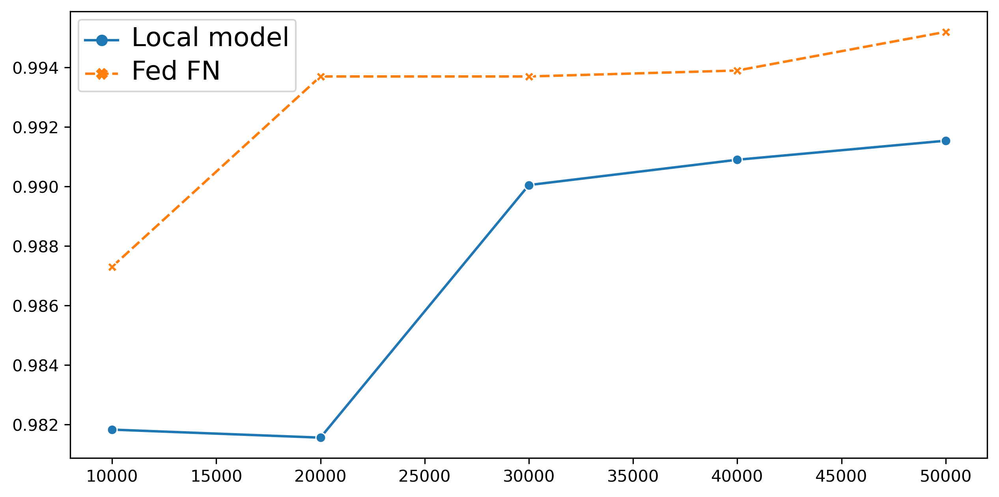
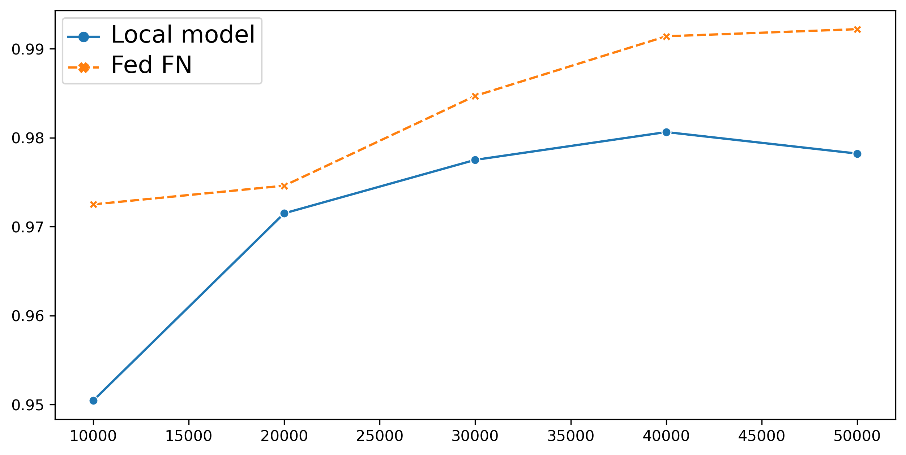
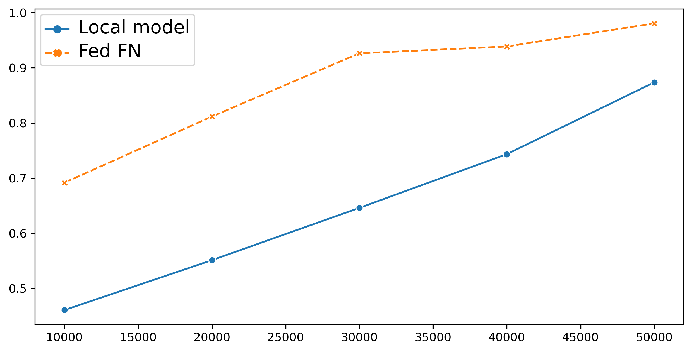

# fedearated_can_ids

## Runing steps 

### Step 1: Download the data file and put them in the following structure: 

```bash
Data/
├── BMW
│   ├── Fuzzy.npz
│   ├── Normal.npz
│   ├── Replay.npz
├── Kia
│   ├── Fuzzy.npz
│   ├── Normal.npz
│   ├── Replay.npz
└── Tesla
    ├── Fuzzy.npz
    ├── Normal.npz
    ├── Replay.npz
```

### Step 2: Run train test split

Go to notebooks/utils/train_test_split.ipynb

#### Step 2a: Generate train/val/test files 

- First change the ```data_dir``` value to match the directory storing your data. 
- Run to next cell to generate train/val/test files.
- The output of one car model folder: 
    ```bash
    Data/
    ├── BMW
    │   ├── Fuzzy.npz
    │   ├── Normal.npz
    │   ├── Replay.npz
    │   ├── test_Fuzzy.npz
    │   ├── test_Normal.npz
    │   ├── test_Replay.npz
    │   ├── train_Fuzzy.npz
    │   ├── train_Normal.npz
    │   ├── train_Replay.npz
    │   ├── val_Fuzzy.npz
    │   ├── val_Normal.npz
    │   └── val_Replay.npz
    ```
#### Step 2b: Generate train/val/test folder

Change the ```out_dir``` and ```in_dir``` to match the directory storing your data.

The ouput: in each folder, it contains mutiple samples in '.npz' format.

```bash
Data/
├── BMW
│   ├── test
│   ├── train
│   ├── val
├── Kia
│   ├── test
│   ├── train
│   ├── val
└── Tesla
    ├── test
    ├── train
    ├── val
```

### Step 3: Training

#### cmd for local train

    Run the file ```src/central_ids.py```

    ```
    CUDA_VISIBLE_DEVICES=0 python central_ids.py 
    --train_dir {The path for training set} 
    --val_dir {The path for validation set}
    --save_dir  {The path for saving models}
    --C {The number of classes, the default value is true = binary classification}
    --batch_size {The batch size for training}
    --lr {The learning rate}
    --epochs {The number of epochs} 
    --val_freq {The validation frequency}
    --weight_decay {The decay for learning rate schedule}
    ```

    Example

    ```bash
    CUDA_VISIBLE_DEVICE=0 python central_ids.py --train_dir ../../Data/LISA/BMW/train_50000/ --val_dir ../../Data/LISA/BMW/val_10000/ --save_dir ../save/BMW/ --C 2 --batch_size 64 --lr 0.005 --epochs 20 --val_freq 1 --weight_decay 0.001
    ```

    Note: adding "CUDA_VISIBLE_DEVICE={cuda_id}" in case of there are multiple gpus

#### cmd for federated learning

1. Run the ```src/server.py```

    ```
    python server.py
    --save_dir {The path for saving the federated model}
    --test_dir {The path storing your dataset}
    --num_rounds {The total number of communication round}
    --epochs {The local epochs for each client}
    --lr {The learning rate for each client}
    --lr_decay {The learning rate decay for each client}
    ```

    Example 

    ```bash
    python server.py --test_dir ../../Data/LISA/{}/test_10000 --save_dir ../save/FedAvg/train10000_50rnds_30epochs_lr0.0005 --num_rounds 50 --batch_size 64 --epochs 30 --lr 0.0005 --lr_decay 0.1 
    ```

2. Run each client

    ```
    python client.py 
    --train_dir {The path for training data, for example if you start with Kia model, it will be 'Data/Kia/train/'}
    --val_dir {The path for validation data}
    ```

    Example 

    ```bash
    python client.py --train_dir ../../Data/LISA/Tesla/train_10000/ --val_dir ../../Data/LISA/Tesla/val_10000/
    ```

3. Finetuning for each client model 

    Go to notebooks/FedAvg_postfinetuning.ipynb 

### Step 4: Get the result 

You can see the results by running the following notebooks:
- Local training result: ```notebooks/test_model.ipynb```
- Federated training result: ```notebooks/test_fed_model.ipynb```
- Federated finetune results: ```notebooks/test_fed_fn.ipynb```


## Experimental results

The comparison between the local model and the proposed model of different car manufacturers.

### Kia



### Tesla



### BMW


